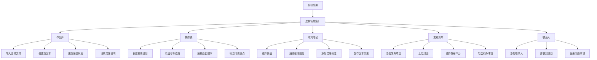

## 1. 产品概述
本产品是一款专为独立音乐人设计的桌面客户端，用于系统化管理未发布音乐作品和排练安排。通过整合作品库、排练表、歌词笔记、发布清单和联系人五大核心模块，帮助音乐人高效组织创作流程、追踪项目进度、维护协作关系。

### 目标用户
- 独立音乐创作者、乐队主唱、音乐制作人
- 需要管理多首未完成作品的创作型音乐人
- 需要组织排练、协调乐队成员的音乐团队

### 产品价值
- 中心化管理所有音乐作品草稿和版本迭代
- 可视化排练计划，确保乐队排练效率
- 结构化歌词创作笔记，捕捉灵感瞬间
- 全流程追踪作品从创作到发布的生命周期
- 维护音乐行业人脉资源和协作沟通记录

---

## 2. 核心功能

### 2.1 功能模块
1. **作品库窗口**: 音频文件导入、歌曲版本管理、编曲状态标记、灵感说明记录、歌词段落维护
2. **排练表窗口**: 排练日期安排、参与成员管理、曲目顺序编排、待练重点标注
3. **歌词笔记窗口**: 歌词段落编辑、版本历史、灵感标注、段落排序
4. **发布清单窗口**: 封面管理、平台列表、上线日期、版权备注、待办事项勾选
5. **联系人窗口**: 乐手/录音师/设计师信息管理、按项目关联沟通事项

### 2.2 页面详情

| 页面名称 | 模块名称 | 功能描述 |
|---------|---------|----------|
| 作品库 | 作品列表 | 卡片式展示所有作品，支持按编曲状态筛选和搜索 |
| 作品库 | 音频导入 | 支持拖拽或选择导入本地音频文件（mp3、wav、m4a） |
| 作品库 | 版本管理 | 记录同一首歌的多个版本（Demo、试唱、编曲版、混音版） |
| 作品库 | 编曲状态 | 标记为：构思中、编曲中、待录制、已录制、混音中、完成 |
| 作品库 | 灵感说明 | 记录创作灵感、参考曲目、情绪基调 |
| 作品库 | 歌词段落 | 快速编辑和管理歌词段落结构 |
| 排练表 | 日历视图 | 月视图展示排练安排，醒目标记排练日期 |
| 排练表 | 排练详情 | 编辑排练日期、时间、地点、参与成员 |
| 排练表 | 曲目顺序 | 拖拽排序本场排练的曲目列表 |
| 排练表 | 待练重点 | 标注每首曲目的重点练习部分和注意事项 |
| 歌词笔记 | 段落编辑器 | 分段落编辑歌词，支持段落类型标记（主歌、副歌、桥段等） |
| 歌词笔记 | 灵感标注 | 在歌词行间插入创作灵感和修改备注 |
| 歌词笔记 | 版本对比 | 查看歌词修改历史，对比不同版本差异 |
| 发布清单 | 作品卡片 | 展示待发布作品封面、标题、平台列表 |
| 发布清单 | 平台管理 | 勾选发布平台（网易云、QQ音乐、Spotify、Apple Music等） |
| 发布清单 | 上线日期 | 设置计划上线日期，显示倒计时 |
| 发布清单 | 版权备注 | 记录版权信息、ISRC编码、合同条款 |
| 发布清单 | 待办勾选 | 发布前检查清单（母带、封面、文案、版权等） |
| 联系人 | 分类列表 | 按乐手、录音师、设计师分类展示 |
| 联系人 | 详情卡片 | 显示联系方式、专业领域、合作历史 |
| 联系人 | 项目关联 | 将联系人关联到具体作品或排练项目 |
| 联系人 | 沟通记录 | 记录与联系人的沟通事项和待跟进内容 |

---

## 3. 核心流程

### 用户主要操作流程

### 作品完整生命周期

---

## 4. 用户界面设计

### 4.1 设计风格

**整体风格**: 深色专业工作室风格，营造专注的创作氛围

**主色调**:
- 背景色：深炭灰 `#121212` - 模拟专业录音室环境
- 主色：暖橙色 `#f97316` - 代表创意与热情
- 辅助色：靛蓝 `#6366f1` - 代表专业与精准

**字体选择**:
- 标题字体：`Space Grotesk` - 现代几何感，适合音乐创作主题
- 正文字体：`Inter` - 清晰易读，保证长时间使用舒适度

**视觉元素**:
- 模拟音频波形装饰元素
- 黑胶唱片纹理背景
- 调音台旋钮风格的状态指示器
- 磁带录音机风格的卡片边框

**动效设计**:
- 窗口切换时的平滑淡入淡出
- 音频播放时的波形动画
- 状态变更时的微妙色彩过渡
- 拖拽排序时的浮动阴影效果

### 4.2 页面设计概览

| 页面名称 | 模块名称 | UI 元素 |
|---------|---------|---------|
| 全局 | 侧边导航 | 深色侧边栏，5个功能图标，选中项橙色高亮，悬停微动效 |
| 全局 | 窗口切换 | 标签页式顶部导航，支持拖拽重排 |
| 作品库 | 作品卡片 | 磁带造型卡片，显示波形缩略图、标题、版本号、状态标签 |
| 作品库 | 详情面板 | 右侧滑出面板，展示音频播放器、版本时间线、灵感笔记 |
| 排练表 | 日历视图 | 月历网格，排练日期橙色标记，悬停显示预览卡片 |
| 排练表 | 时间轴 | 排练当天的时间轴视图，显示曲目顺序和时长分配 |
| 歌词笔记 | 编辑器 | 稿纸风格背景，段落分块显示，可折叠展开 |
| 发布清单 | 看板视图 | 按发布阶段分列的看板，支持拖拽卡片变更阶段 |
| 联系人 | 名片卡片 | 拟物化名片设计，分类标签彩色区分 |

### 4.3 响应式设计

- **桌面优先**: 主窗口最小尺寸 1280x800
- **窗口自适应**: 支持窗口缩放，内容区域自动调整布局
- **面板可折叠**: 详情面板支持折叠，为列表区域腾出更多空间
- **触控优化**: 按钮和交互元素尺寸适中，支持触控屏操作

### 4.4 无障碍设计

- 所有交互元素支持键盘导航
- 颜色对比度符合 WCAG AA 标准
- 状态变化除颜色外另有图标或文字标识
- 支持系统级深色/浅色主题跟随
