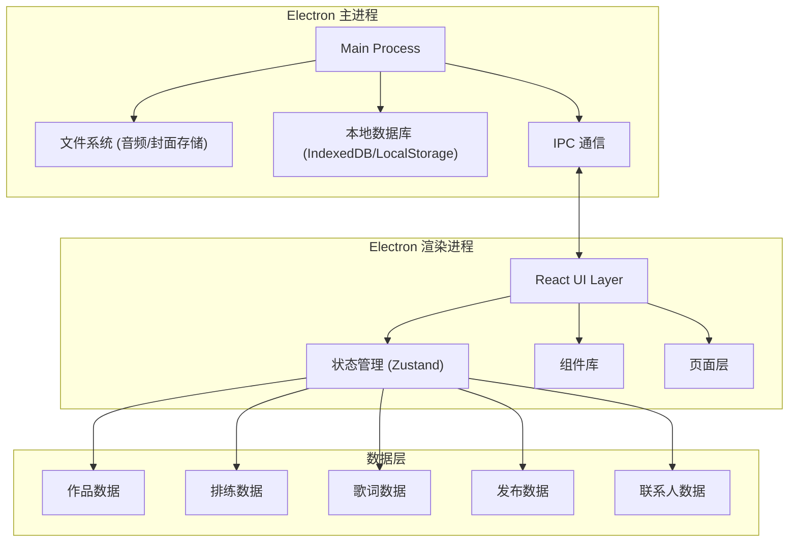
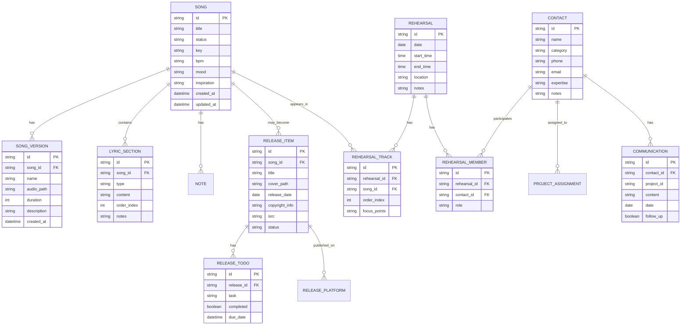

## 1. 架构设计



---

## 2. 技术描述

### 技术栈选型
- **桌面框架**: Electron 28.x - 跨平台桌面应用框架
- **前端框架**: React 18.x + TypeScript 5.x
- **构建工具**: Vite 5.x - 快速开发构建
- **样式方案**: Tailwind CSS 3.x - 原子化 CSS
- **状态管理**: Zustand 4.x - 轻量级状态管理
- **路由管理**: React Router DOM 6.x
- **图标库**: Lucide React
- **数据持久化**: 
  - LocalStorage 用于配置和轻量数据
  - IndexedDB (via Dexie.js) 用于结构化数据存储
  - 文件系统存储音频文件和封面图片
- **音频处理**: Web Audio API / HTML5 Audio Player

### 项目初始化
- 使用 `electron-vite` 模板初始化项目
- 配置 TypeScript 严格模式
- 集成 Tailwind CSS 自定义主题
- 配置 ESLint + Prettier 代码规范

---

## 3. 路由定义

| 路由路径 | 页面名称 | 功能说明 |
|---------|---------|----------|
| `/library` | 作品库 | 展示和管理所有音乐作品 |
| `/rehearsals` | 排练表 | 日历视图和排练计划管理 |
| `/lyrics` | 歌词笔记 | 歌词编辑和版本管理 |
| `/releases` | 发布清单 | 发布项目管理和待办清单 |
| `/contacts` | 联系人 | 人脉资源管理和沟通记录 |

---

## 4. 数据模型

### 4.1 ER 图



### 4.2 类型定义

```typescript
// 作品状态类型
type SongStatus = 'idea' | 'arranging' | 'to_record' | 'recorded' | 'mixing' | 'completed';

// 歌词段落类型
type LyricType = 'intro' | 'verse' | 'pre_chorus' | 'chorus' | 'bridge' | 'outro' | 'instrumental';

// 联系人类别
type ContactCategory = 'musician' | 'engineer' | 'designer' | 'manager' | 'other';

// 发布状态
type ReleaseStatus = 'planning' | 'ready' | 'submitted' | 'published' | 'archived';

// 平台类型
type PlatformType = 'netease' | 'qq' | 'spotify' | 'apple' | 'youtube' | 'bandcamp' | 'other';

interface Song {
  id: string;
  title: string;
  status: SongStatus;
  key?: string;
  bpm?: number;
  mood?: string;
  inspiration?: string;
  createdAt: string;
  updatedAt: string;
}

interface SongVersion {
  id: string;
  songId: string;
  name: string;
  audioPath: string;
  duration?: number;
  description?: string;
  createdAt: string;
}

interface LyricSection {
  id: string;
  songId: string;
  type: LyricType;
  content: string;
  orderIndex: number;
  notes?: string;
}

interface Rehearsal {
  id: string;
  date: string;
  startTime: string;
  endTime: string;
  location: string;
  notes?: string;
}

interface RehearsalTrack {
  id: string;
  rehearsalId: string;
  songId: string;
  orderIndex: number;
  focusPoints?: string;
}

interface Contact {
  id: string;
  name: string;
  category: ContactCategory;
  phone?: string;
  email?: string;
  expertise?: string;
  notes?: string;
}

interface ReleaseItem {
  id: string;
  songId?: string;
  title: string;
  coverPath?: string;
  releaseDate?: string;
  copyrightInfo?: string;
  isrc?: string;
  status: ReleaseStatus;
  platforms: PlatformType[];
}

interface ReleaseTodo {
  id: string;
  releaseId: string;
  task: string;
  completed: boolean;
  dueDate?: string;
}

interface Communication {
  id: string;
  contactId: string;
  projectId?: string;
  content: string;
  date: string;
  followUp: boolean;
}
```

---

## 5. 状态管理设计

### Zustand Store 结构

```typescript
interface AppState {
  // 作品
  songs: Song[];
  songVersions: SongVersion[];
  lyrics: LyricSection[];
  
  // 排练
  rehearsals: Rehearsal[];
  rehearsalTracks: RehearsalTrack[];
  
  // 联系人
  contacts: Contact[];
  communications: Communication[];
  
  // 发布
  releases: ReleaseItem[];
  releaseTodos: ReleaseTodo[];
  
  // UI 状态
  activeTab: TabType;
  selectedSongId?: string;
  selectedRehearsalId?: string;
  
  // 操作方法
  addSong: (song: Omit<Song, 'id' | 'createdAt' | 'updatedAt'>) => void;
  updateSong: (id: string, updates: Partial<Song>) => void;
  deleteSong: (id: string) => void;
  addSongVersion: (version: Omit<SongVersion, 'id' | 'createdAt'>) => void;
  addRehearsal: (rehearsal: Omit<Rehearsal, 'id'>) => void;
  addContact: (contact: Omit<Contact, 'id'>) => void;
  addRelease: (release: Omit<ReleaseItem, 'id'>) => void;
  toggleReleaseTodo: (todoId: string) => void;
  
  // 持久化
  loadFromStorage: () => void;
  saveToStorage: () => void;
}
```

---

## 6. 项目结构

```
d:\TraeProjects\1293/
├── electron/                          # Electron 主进程
│   ├── main.ts                        # 主进程入口
│   ├── preload.ts                     # 预加载脚本
│   └── ipc/                           # IPC 通信处理
├── src/
│   ├── components/                    # 通用组件
│   │   ├── layout/                    # 布局组件
│   │   │   ├── Sidebar.tsx            # 侧边导航
│   │   │   └── WindowTabs.tsx         # 窗口标签
│   │   ├── ui/                        # UI 基础组件
│   │   │   ├── Button.tsx
│   │   │   ├── Card.tsx
│   │   │   ├── Input.tsx
│   │   │   ├── Modal.tsx
│   │   │   └── StatusBadge.tsx
│   │   └── audio/                     # 音频组件
│   │       └── AudioPlayer.tsx
│   ├── pages/                         # 页面组件
│   │   ├── LibraryPage.tsx            # 作品库
│   │   ├── RehearsalsPage.tsx         # 排练表
│   │   ├── LyricsPage.tsx             # 歌词笔记
│   │   ├── ReleasesPage.tsx           # 发布清单
│   │   └── ContactsPage.tsx           # 联系人
│   ├── store/                         # 状态管理
│   │   └── useAppStore.ts
│   ├── types/                         # 类型定义
│   │   └── index.ts
│   ├── utils/                         # 工具函数
│   │   ├── storage.ts                 # 本地存储
│   │   ├── audio.ts                   # 音频处理
│   │   └── date.ts                    # 日期处理
│   ├── data/                          # 示例数据
│   │   └── mockData.ts
│   ├── App.tsx
│   ├── main.tsx
│   └── index.css
├── public/
│   └── assets/                        # 静态资源
├── package.json
├── tsconfig.json
├── vite.config.ts
├── electron.vite.config.ts
├── tailwind.config.js
└── postcss.config.js
```

---

## 7. 关键技术决策

1. **Electron 选择**: 虽然用户要求桌面客户端，但 Electron 提供了最佳的跨平台兼容性和 Web 技术栈复用，开发效率高。

2. **数据存储方案**: 
   - 结构化数据使用 IndexedDB (Dexie.js) 提供查询能力
   - 音频文件和封面图片存储在用户文档目录下的应用文件夹
   - 配置和偏好设置使用 LocalStorage

3. **状态管理**: Zustand 相比 Redux 更轻量，API 更简洁，适合中小型桌面应用。

4. **样式方案**: Tailwind CSS 配合自定义主题，快速实现深色专业风格 UI。

5. **性能考虑**: 
   - 音频文件使用流式加载，不全部读入内存
   - 大数据列表使用虚拟滚动
   - 状态更新使用不可变更新模式
